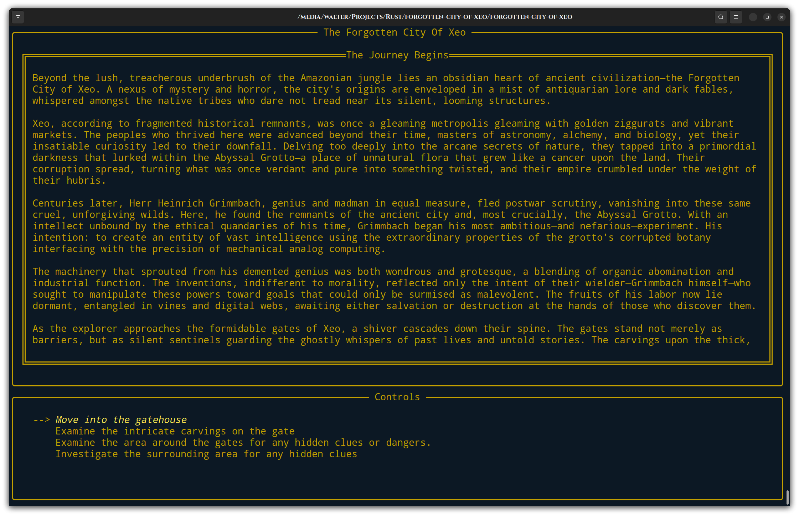

# The Forgotten City Of Xeo

Deep within the dense jungle of the Amazon, shrouded in mist and mystery, lies the ancient and forgotten city of Xeo. Lost to the passage of time, Xeo holds untold the mysteries that you have spent years pursuing. As you finally stand at the edge of the jungle, the dense canopy above casts the world below in shadow. The air is thick with humidity, and the sounds of wildlife echo through the trees. Yet amidst the vibrant greenery, a sense of foreboding hangs heavy in the air, hinting at the secrets that lie hidden within the heart of Xeo.<br>

Your journey into the depths of the jungle begins here, where every step brings you closer to the enigmatic city's embrace. With each stride, you push through the tangled undergrowth, forging a path into the unknown. The journey ahead is fraught with danger, but also promises adventure and discovery beyond your wildest dreams.<br>

As you venture deeper into the jungle, the ruins of a forgotten civilization begin to emerge from the foliage. Crumbling stone structures peek through the vines, their weathered surfaces bearing silent witness to the passage of centuries. And amidst the ruins, the whispers of Xeo beckon you closer, urging you to uncover its secrets and unlock its hidden treasures. But beware, for you are not alone in your quest. Ancient guardians and fearsome creatures lurk in the shadows, ready to defend Xeo's secrets from intruders. And darker forces still may be at play, hidden in the depths of the jungle's tangled embrace.<br>

Your fate and the fate of Xeo itself hang in the balance as you embark on this perilous journey into the heart of the Amazon. Will you uncover the truth behind the city's downfall, or will you become just another lost soul, swallowed by the jungle's depths?<br>

The answers lie waiting to be discovered in the forgotten city of Xeo. Are you brave enough to unlock its mysteries and claim its treasures as your own?




## Current Map Of The Forgotten City Of Xeo


## Background

Welcome to *The Forgotten City Of Xeo*, a text adventure game inspired by iconic games such as *Colossal Cave Adventure*. It introduces a unique twist to the classic gaming genre by harnessing the power of ChatGPT. The game began as a learning project when I began to learning the Rust programming language. I was wanting to play around a little with the ChatGPT API and the Ratatui terminal user interfaces looked pretty cool and the thought of AI narrating an adventure game seemed a pretty cool and fun project to learn Rust.

It is very simple game and the the main highlight of this game is that each playthrough text is generated on-the-fly using OpenAI's ChatGPT, offering a unique narrative every time you play. While the main storyline is on rails, the way you traverse the narrative landscape and experience the world will differ each time, all thanks to the dynamic text generation capability of ChatGPT.


## Playing
!! Note there is a small delay because of the call to ChatGPT API. !!
It is compiling clean with cargo run.  Or there are some binaries in build that may or may not work. The only thing needed is to add your openAI API token to the gamesettings.json file in the data directory under the field token and select the gpt model you want to use if different than the default Gpt3_5Turbo.


Have tested: 
    * Gpt3_5Turbo
    * Gpt_4
    * Gpt_4Turbo

The quality of output for the Gpt 4 models is very good but does tend to overfow the current text area (and does eat some tokens, quickly). This is on the backlog to fix scrolling.  

The app configuration part of the gamesettings.json should look like something like this
```
 "app": {
    "chat_config": {
      "token": "YOUR-TOKEN-GOES-RIGHT-HERE"
      "model": "Gpt3_5Turbo",
    }
  },
```

## Acknowledgements

A special thanks for the people working on Ratatui, making terminals looks awesome!
A special thanks to OpenAI for their technology that powers the soul of this game!

## Contributing 

Please feel welcome to contribute!  Even if it is just locations and actions.  The prompt system and game flow for locations is super simple. Inside of gamesettings there is a locations array and each location has a location object and as long as some other location points towards it with a move command_type, it will be accessible.  The actions type in commands doesn't change location but is only a prompt to pull text into the location. Indeed the generative nature of this app the whole story could be easily changed just by changing the gamesettings.json 


Here is an example from the The Gatehouse object.

```
{
      "id": "gatehouse",
      "name": "The Gatehouse",
      "description": "It rises like an insolent challenge to the verdant wilderness around it, promising a gateway to a world long lost and secrets buried in time. Its unyielding walls demonstrate human deftness, each brick stacked with precision despite the wear and tear of ages. The facades of the gatehouse are adorned with intricate reliefs, inscriptions and pictographs, etched deeply into the walls. Spiralling designs frame the ominous entryway and stretch upwards with a sense of determined ambition. Every inch of the edifice is covered, no doubt with stories and tales of the ancient tribe that once thrived here. Among the repeating patterns, you notice certain images making an appearance more often than others: a gilded sun, a twisted serpent, a hand reaching for a star, and strange plant-life which seems to have a menacing undertone",
      "prompt": "Describe the Gatehouse as the adventure aproaches it. It is forboding and covered in jungle vines and carved relief from the ancient tribe that build the city. Be verbose and build upon how it fits into the history of The Forgotten City Of Xeo.",
      "commands": [
        {
          "command_type": "action",
          "label": "Examine the avenue ahead of you",
          "location": "",
          "prompt": "Peer down the avenue of Guilty Gears."
        },
        {
          "command_type": "move",
          "label": "Travel along the avenue in front of you.",
          "location": "avenue_one",
          "prompt": ""
        },
        {
          "command_type": "move",
          "label": "Move to the building on the right where there are different bits of mechanical contruct poking through the green overgrowth.",
          "location": "mech_lab",
          "prompt": ""
        },
        {
          "command_type": "move",
          "label": "Veer to the left in what appears to be an ancient market area.",
          "location": "market",
          "prompt": ""
        }
      ]
    },
```