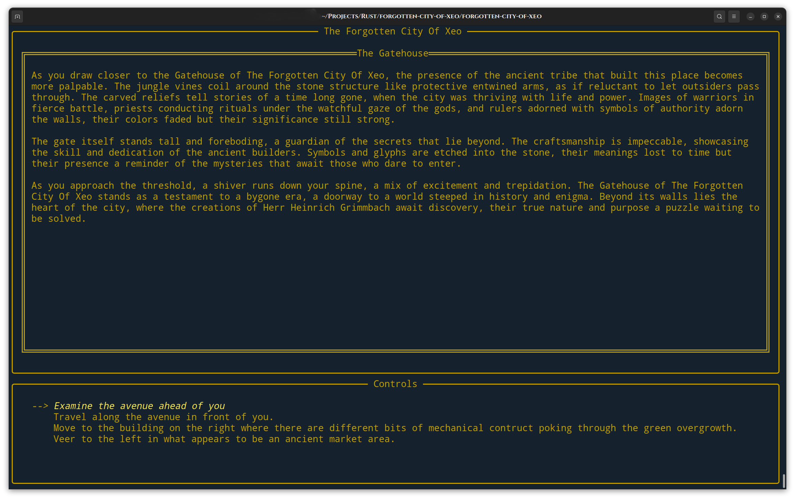
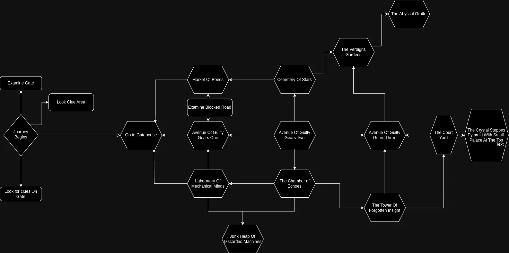

# The Forgotten City Of Xeo

Deep within the dense jungle of the Amazon, shrouded in mist and mystery, lies the ancient and forgotten city of Xeo. Lost to the passage of time, Xeo holds untold the mysteries that you have spent years pursuing. As you finally stand at the edge of the jungle, the dense canopy above casts the world below in shadow. The air is thick with humidity, and the sounds of wildlife echo through the trees. Yet amidst the vibrant greenery, a sense of foreboding hangs heavy in the air, hinting at the secrets that lie hidden within the heart of Xeo. 

Your journey into the depths of the jungle begins here, where every step brings you closer to the enigmatic city's embrace. With each stride, you push through the tangled undergrowth, forging a path into the unknown. The journey ahead is fraught with danger, but also promises adventure and discovery beyond your wildest dreams. 

As you venture deeper into the jungle, the ruins of a forgotten civilization begin to emerge from the foliage. Crumbling stone structures peek through the vines, their weathered surfaces bearing silent witness to the passage of centuries. And amidst the ruins, the whispers of Xeo beckon you closer, urging you to uncover its secrets and unlock its hidden treasures. But beware, for you are not alone in your quest. Ancient guardians and fearsome creatures lurk in the shadows, ready to defend Xeo's secrets from intruders. And darker forces still may be at play, hidden in the depths of the jungle's tangled embrace. 

Your fate and the fate of Xeo itself hang in the balance as you embark on this perilous journey into the heart of the Amazon. Will you uncover the truth behind the city's downfall, or will you become just another lost soul, swallowed by the jungle's depths? 

The answers lie waiting to be discovered in the forgotten city of Xeo. Are you brave enough to unlock its mysteries and claim its treasures as your own?

## Background

Welcome to *The Forgotten City Of Xeo*, a text adventure game inspired by iconic games such as *Colossal Cave Adventure*. It introduces a unique twist to the classic gaming genre by harnessing the power of ChatGPT. The game began as a learning project when I began to learning the Rust programming language. I was wanting to play around a little with the ChatGPT API and the Ratatui terminal user interfaces looked pretty cool and the thought of AI narrating an adventure game seemed a pretty cool and fun project to learn Rust.

The main highlight of this game is that each playthrough text is generated on-the-fly using OpenAI's GPT-3.5 model, offering a unique narrative every time you play. While the main storyline is on rails, the way you traverse the narrative landscape and experience the world will differ each time, all thanks to the dynamic text generation capability of ChatGPT.

## Playing

It is compiling clean with cargo run.  The only thing needed is to add your openAI API token to the gamesettings.json file in the data directory.

## Installation

As of right now there are no release binaries compiled.  Hopefully coming soon!

## Acknowledgements

A special thanks for the people working on Ratatui, making terminals looks awesome!
A special thanks to OpenAI for their technology that powers the soul of this game!

## Contributing 

Please feel welcome to contribute!